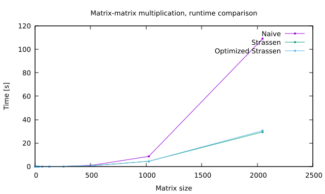

Strassen Algorithm
------------------

The `code` folder contains the implementation of the Strassen algorithm for matrix-matrix multiplication. In particular, `strassen.c` implements an allegedly optimized version of the algorithm, which aims at minimizing the memory allocation.

The original version allocates 17 matrices for each recursive step, resulting in a considerable amount of memory allocated. On the other hand the optimized version, allocates just one auxiliary matrix $\underset{n\times n}U$ (alongside the three $A\times B = C$ matrices), where $n$ is the size of the matrices. The  `opt_strassen_aux` function exploits different quadrants of the $C$ and $U$ matrices to perform the required computation.

The following plot shows the results for a mean over 10 runs.

As expected, the naive implementation provides slower execution time, performing worse than the Strassen implementations. Quite surprisingly, the provided and the optimized implementations of the Strassen algorithm perform identically, suggesting that (for sizes up to $n = 2^{11}$), the time required to allocate/deallocate resources is negligible.